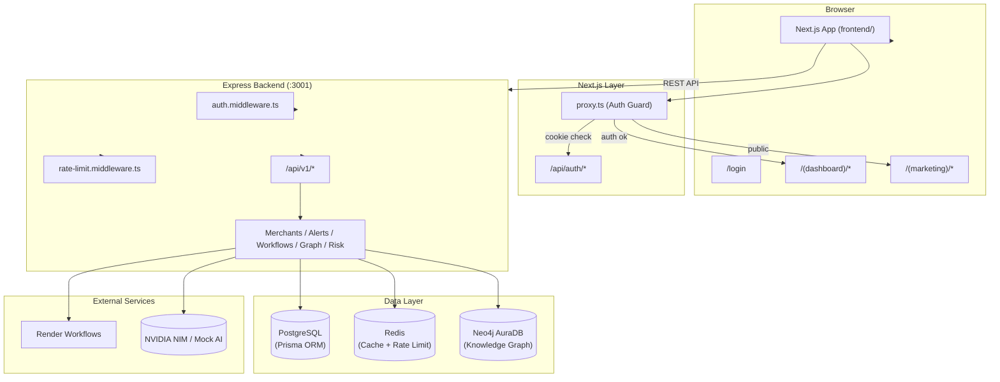
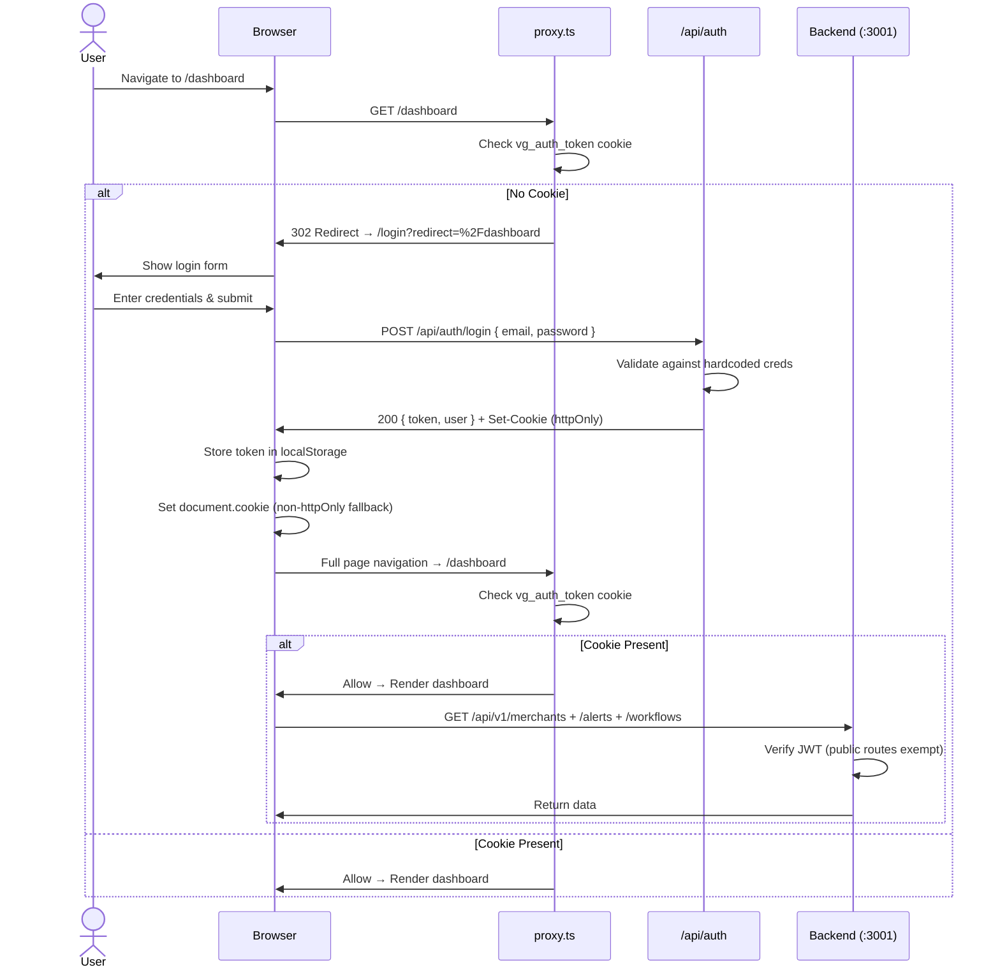
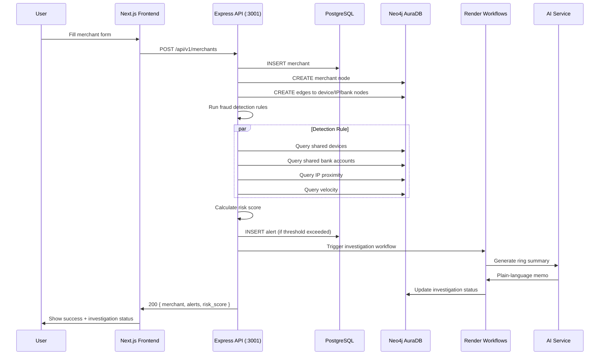
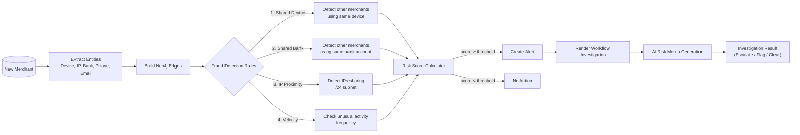
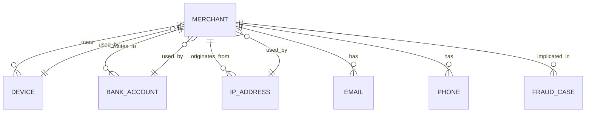
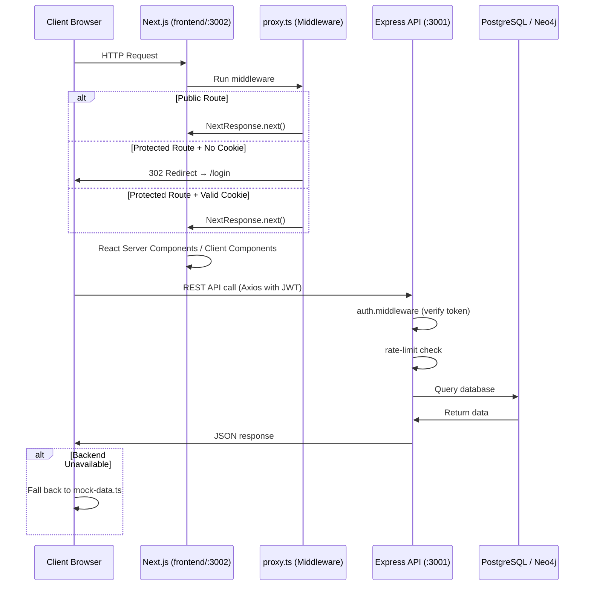

# Vanguard Graph — Architecture

This document describes the system architecture using mermaid diagrams for the Vanguard Graph fraud coordination intelligence engine.

---

## 1. System Architecture (High-Level)

---

## 2. Authentication Flow

---

## 3. Merchant Onboarding Flow

---

## 4. Fraud Detection Pipeline

---

## 5. Data Model (Neo4j Graph)

---

## 6. Frontend Component Tree

```mermaid
graph TB
    Root["RootLayout<br/>(AuthProvider)"] --> Marketing["(marketing)/layout"]
    Root --> Login["/login"]
    Root --> Dashboard["(dashboard)/layout<br/>(QueryClientProvider)"]

    Marketing --> Landing["/ (Landing Page)"]
    Marketing --> Docs["/docs"]
    Marketing --> Pricing["/pricing"]

    Dashboard --> Sidebar["_components/sidebar.tsx"]
    Dashboard --> Topbar["_components/topbar.tsx"]
    Dashboard --> CmdMenu["_components/command-menu.tsx"]

    Dashboard --> DB["/dashboard"]
    Dashboard --> Alerts["/alerts"]
    Dashboard --> Investigations["/investigations"]
    Dashboard --> Merchants["/merchants"]
    Dashboard --> Graph["/graph"]
    Dashboard --> Workflows["/workflows"]
    Dashboard --> Settings["/settings"]

    DB --> StatCards["StatCard × 4"]
    DB --> AlertChart["AlertTrendChart"]
    DB --> RiskChart["RiskDistributionChart"]
    DB --> RecentAlerts["Recent Alerts Table"]
    DB --> ActiveWorkflows["Active Workflows Table"]

    Alerts --> AlertFilters["AlertFilters"]
    Alerts --> AlertsTable["AlertsTable"]

    Merchants --> MerchantsTable["MerchantsTable"]
    Merchants --> MerchantForm["MerchantForm"]
    Merchants --> MerchantProfile["MerchantProfile"]
    Merchants --> LinkedEntities["LinkedEntities"]
    Merchants --> MerchantTimeline["MerchantTimeline"]

    Investigations --> InvTable["InvestigationsTable"]
    Investigations --> RingReplay["RingReplay"]
    Investigations --> RiskMemoCard["RiskMemoCard"]
    Investigations --> EvidencePanel["EvidencePanel"]

    Graph --> GraphCanvas["GraphCanvas"]
    Graph --> NodeDrawer["NodeDrawer"]
    Graph --> GraphLegend["GraphLegend"]

    Workflows --> WorkflowTable["WorkflowRunsTable"]
```

---

## 7. Request Lifecycle

